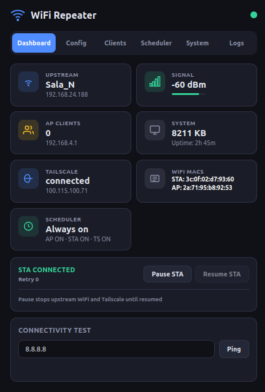
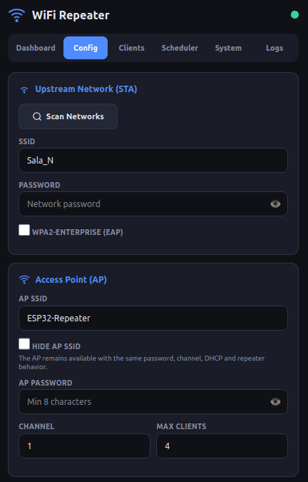
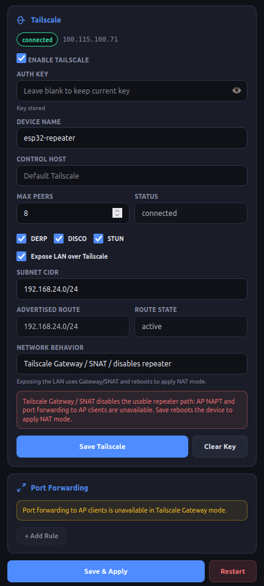
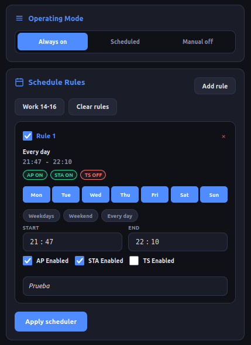
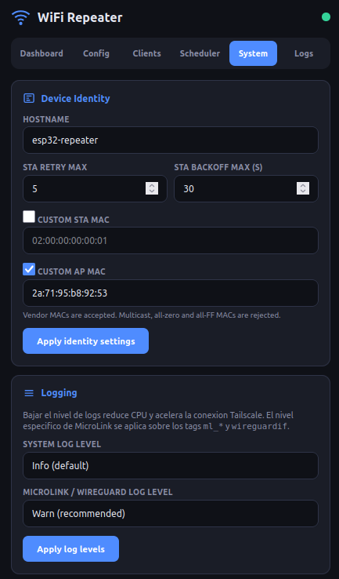

# ESP32-S3 Tailscale WPA2-Enterprise (Advertise Routes)

Repetidor WiFi basado en **ESP32-S3** con soporte para **WPA2-Enterprise** y cliente **Tailscale** integrado (con capacidad de anunciar rutas LAN).

[🇺🇸 English version](README.md)

Toda la configuración se realiza mediante una **interfaz web profesional** servida desde el propio dispositivo, con dark theme responsive.

<p align="center">
  <a href="img/screenshot1.png"></a>
  <a href="img/screenshot2.png"></a>
  <a href="img/screenshot3.png"></a>
  <a href="img/screenshot4.png"></a>
  <a href="img/screenshot5.png"></a>
</p>

## Características Principales

### 🎓 WPA2-Enterprise y Repetidor WiFi
- **STA+AP simultáneo** — Se conecta a una red WiFi (STA) y crea su propio punto de acceso (AP)
- **WPA2-Enterprise** — Soporte EAP-PEAP/TTLS para redes corporativas/universitarias
- **NAPT y Port Forwarding** — Traducción de direcciones de red para los clientes del AP y hasta 5 reglas de redirección de puertos
- **SSID ocultable** — Opción para ocultar el SSID del AP sin cambiar contraseña, canal o DHCP
- **Reconexión no bloqueante** — Reintentos STA con backoff, modo recovery y captive portal disponible
- **Identidad configurable** — Hostname y MAC custom para STA/AP, incluyendo MACs de fabricante
- **Pause/Resume STA** — Pausa manual de la conexión upstream sin apagar el AP local
- **Dashboard en tiempo real** — RSSI, clientes, MAC STA/AP reales, heap libre y estado de Tailscale
- **Ping integrado** — Test de conectividad ICMP con resolución DNS

### 🛣️ Tailscale con Advertise Routes
- **Cliente Tailscale embebido** — Mediante MicroLink (implementación nativa C/FreeRTOS)
- **Advertise Routes (Subnet Router / Gateway SNAT)** — Anuncia rutas LAN con `Hostinfo.RoutableIPs` y hace SNAT hacia la LAN para acceder a equipos locales sin tocar el router principal
- **IP VPN 100.x.y.z** — Se une a tu Tailnet como un nodo más
- **Autenticación Noise IK** — Handshake criptográfico con `controlplane.tailscale.com:443`
- **DERP relay** — Conexión con peers a través de relays globales cuando no hay conectividad directa
- **Reconexión automática** — Tras cambios de WiFi o pérdida de conectividad

### 💻 Web UI
- **Dark theme** — Diseño moderno responsive mobile-first, sin frameworks externos
- **HTTP Basic Auth** — Credenciales configurables desde la interfaz
- **Configuración completa** — Red WiFi, EAP, port forwarding, Tailscale, hostname, MACs y logging
- **Log viewer** — Visor de logs en tiempo real (32KB buffer circular)
- **Logging runtime** — Nivel global y nivel MicroLink/WireGuard ajustables sin reiniciar WiFi
- **OTA Updates** — Actualización de firmware vía web con particiones duales y rollback automático
- **Factory Reset** — Restaurar configuración de fábrica desde la web o con el botón BOOT

## Hardware

### ESP32-S3 N16R8 (Recomendado para Tailscale)

| Componente | Detalle |
|---|---|
| **Chip** | ESP32-S3 (Xtensa dual-core 240MHz) |
| **Flash** | 16MB |
| **PSRAM** | 8MB octal |
| **WiFi** | 802.11 b/g/n, 2.4GHz |
| **Conector** | USB-C (nativo + UART) |

## Compilar

### Requisitos

- **ESP-IDF v6.1-dev** o superior ([guía de instalación](https://docs.espressif.com/projects/esp-idf/en/stable/esp32/get-started/))

### Compilar

```bash
source ~/esp/esp-idf/export.sh

idf.py set-target esp32s3
idf.py -B build_s3 build
```

### Flash

```bash
idf.py -B build_s3 -p /dev/ttyACM0 flash
```

### Monitor serie

```bash
idf.py -p /dev/ttyACM0 monitor
# Salir: Ctrl+]
```

## Uso

1. **Flashear** el firmware en el ESP32
2. **Conectarse** a la red WiFi **`ESP32-Repeater`** (contraseña: `12345678`)
3. **Abrir** [http://192.168.4.1](http://192.168.4.1) (o esperar al captive portal)
4. **Login** con usuario `admin` / contraseña `admin`
5. Ir a **Config** → **Scan Networks** → seleccionar la red a repetir
6. Introducir contraseña (o datos EAP) y pulsar **Save & Apply**
7. Verificar en el **Dashboard** la IP obtenida y la señal

### Configurar Tailscale (Web UI)

1. Ir a **Config** → **Tailscale**
2. Activar **Enable Tailscale**
3. Pegar **Auth Key** de [tailscale.com/admin/settings/keys](https://tailscale.com/admin/settings/keys)
4. Configurar **Device Name** (opcional)
5. Pulsar **Save Tailscale**
6. El dispositivo se conectará en ~60s y aparecerá en tu Tailnet

### Tailscale: Exit Node vs Subnet Router

Un **Exit Node** enruta todo el tráfico de un cliente Tailscale hacia Internet. Este firmware no se anuncia como exit node.

Un **Subnet Router** anuncia una o varias redes LAN, por ejemplo `192.168.1.0/24`, para que otros clientes del tailnet puedan llegar a los dispositivos. Este proyecto implementa el anuncio de rutas de subred mediante `Hostinfo.RoutableIPs`.

El aviso de Tailscale *"This device does not advertise itself as an exit node"* no impide usar subnet routing.

### Modos de red Tailscale

| Modo | Repetidor WPA2-Enterprise | Port forwarding AP clients | Acceso Tailscale a LAN sin tocar router | Requiere ruta de retorno |
|---|---|---|---|---|
| Repeater / Tailscale node only | Sí | Sí | No | No |
| Tailscale Gateway / SNAT with LAN route | No usable como repetidor | No | Sí | No |

#### Repeater / Tailscale node only
Este es el modo predeterminado y seguro.
- AP activo y NAPT activo en la interfaz AP.
- Los clientes del AP tienen Internet a través de la STA.
- Tailscale se conecta como un nodo normal, sin anunciar rutas.

#### Tailscale Gateway / SNAT (Advertise Routes)
Este modo está pensado para acceder de la VPN a la LAN (`Tailscale -> LAN`) sin modificar las rutas estáticas del router de la casa, haciendo SNAT en el ESP32.
Activar **Expose LAN over Tailscale** anuncia la ruta LAN y fuerza el modo Gateway/SNAT. Desactiva el NAPT en el AP y activa NAPT solo en la interfaz WireGuard. El tráfico que entra por la VPN sale hacia la red local con la IP del ESP32.

### Troubleshooting Tailscale routes

- Comprueba que la ruta de subred aparece y está aprobada en el panel de Tailscale.
- En clientes móviles, asegúrate de activar el uso de subnets si la app lo requiere.
- Prueba por IP directa, por ejemplo `ping 192.168.1.1` (no dependas de mDNS).
- Si activas **Expose LAN over Tailscale**, el dispositivo pasa a Gateway/SNAT: no necesitas configurar rutas de retorno en tu router.

### OTA Update

```bash
  curl -u admin:admin -X POST http://192.168.4.1/api/ota \
    --data-binary @firmware/wifi_repeater.bin
```

## API REST

El dispositivo expone una API REST completa para monitorización y configuración.  
> 🔒 **Seguridad:** Todos los endpoints bajo `/api/*` requieren **HTTP Basic Auth** utilizando las credenciales de administración.

| Endpoint | Método | Descripción |
|---|:---:|---|
| `/api/status` | `GET` | Estado general del sistema (STA, RSSI, MAC STA/AP, clientes, heap, uptime). |
| `/api/wifi/state` | `GET` | Estado detallado de la conexión STA (`connected`, `retry_count`, `recovery`, `paused`). |
| `/api/wifi/pause` | `POST` | Pausa la conexión upstream STA y detiene los reintentos automáticos. |
| `/api/wifi/resume` | `POST` | Reanuda la conexión upstream STA y sus reintentos. |
| `/api/scan` | `GET` | Inicia un escaneo de redes WiFi cercanas y devuelve los resultados. |
| `/api/config` | `GET` | Obtiene la configuración actual (WiFi, AP, EAP, Port Forwarding, MACs, etc.). |
| `/api/config` | `POST` | Aplica y guarda una nueva configuración en la memoria NVS. |
| `/api/clients` | `GET` | Lista de clientes actualmente conectados al AP (IP y MAC). |
| `/api/ping` | `POST` | Ejecuta un test ICMP. Payload requerido: `{"target":"8.8.8.8"}`. |
| `/api/restart` | `POST` | Reinicia el dispositivo (Soft Reset). |
| `/api/auth/check` | `GET` | Verifica la validez de las credenciales actuales. |
| `/api/auth/change` | `POST` | Modifica las credenciales de acceso HTTP Basic Auth. |
| `/api/ota` | `POST` | Endpoint para subida de binarios de actualización de firmware (OTA). |
| `/api/factory-reset` | `POST` | Restaura los valores de fábrica borrando la NVS. |
| `/api/logs` | `GET` | Obtiene el buffer circular de logs del sistema en formato `text/plain`. |
| `/api/loglevel` | `POST` | Ajusta los niveles de log en tiempo de ejecución (Global y MicroLink). |
| `/api/tailscale/status` | `GET` | Obtiene el estado actual de la conexión de Tailscale y sus peers. |
| `/api/tailscale/config` | `GET` | Lee la configuración actual de Tailscale (Auth Key, Hostname, etc.). |
| `/api/tailscale/config` | `POST` | Guarda y aplica la configuración de Tailscale. |

## Estructura del Proyecto e Internos

```
┌──────────┐    WiFi AP    ┌──────────────┐    WiFi STA   ┌────────┐
│ Cliente  │◄─────────────►│  ESP32-S3    │◄─────────────►│ Router │
│ (móvil)  │  192.168.4.x  │  NAPT + DNS  │  192.168.1.x  │  (WAN) │
└──────────┘               └──────┬───────┘               └────────┘
                                  │
                                  │ Tailscale
                                  ▼
                          ┌──────────────┐
                          │   Tailnet    │
                          │ 100.81.77.58 │
                          └──────────────┘
```

## Repositorio
[https://github.com/soyunomas/esp32-s3-tailscale-enterprise](https://github.com/soyunomas/esp32-s3-tailscale-enterprise)

## Agradecimientos

- **[CamM2325/microlink](https://github.com/CamM2325/microlink)**: Implementación nativa en C del protocolo Tailscale para ESP32.
- **Espressif Systems**: Framework ESP-IDF.
- **Tailscale**: Infraestructura y protocolos de la red VPN mesh.

## Licencia
MIT